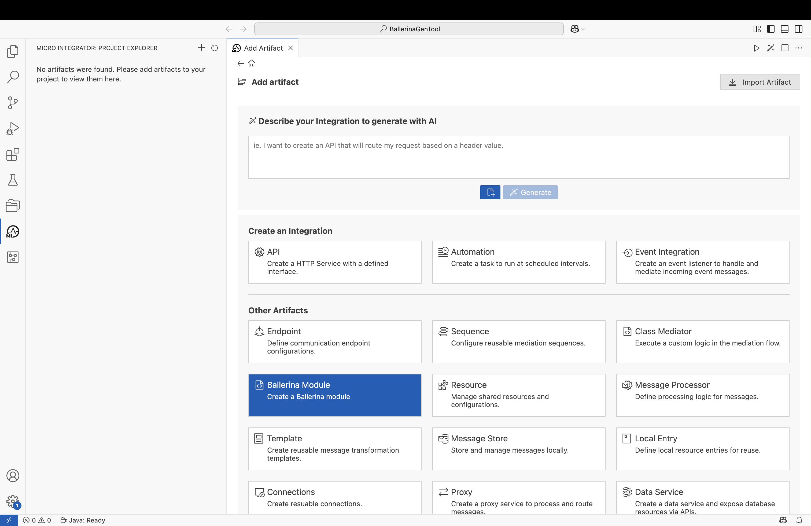
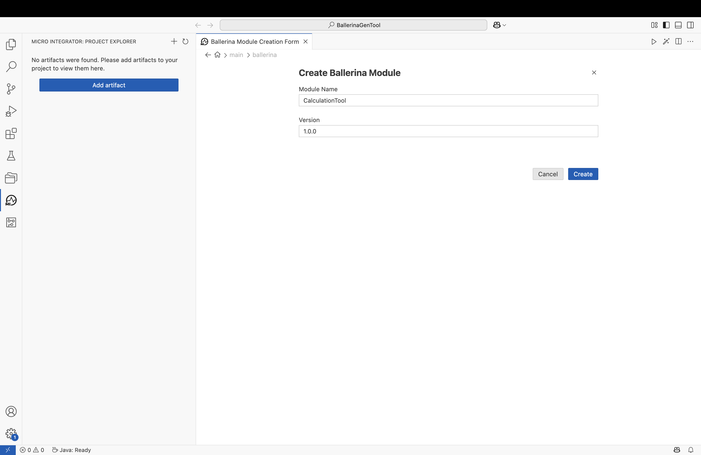
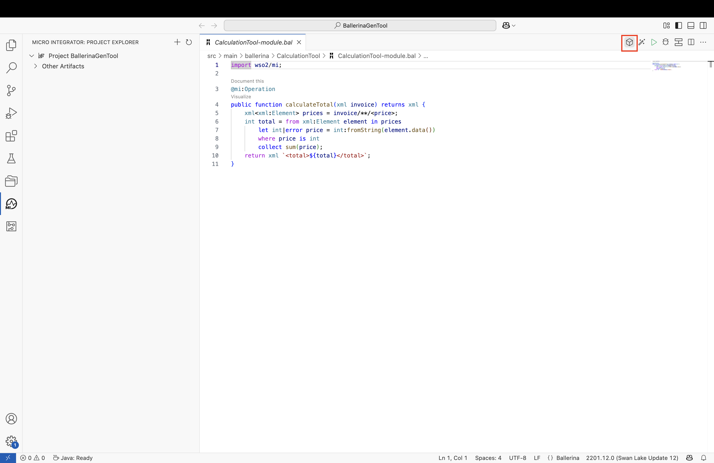
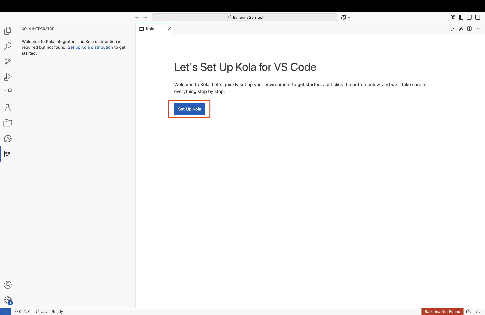
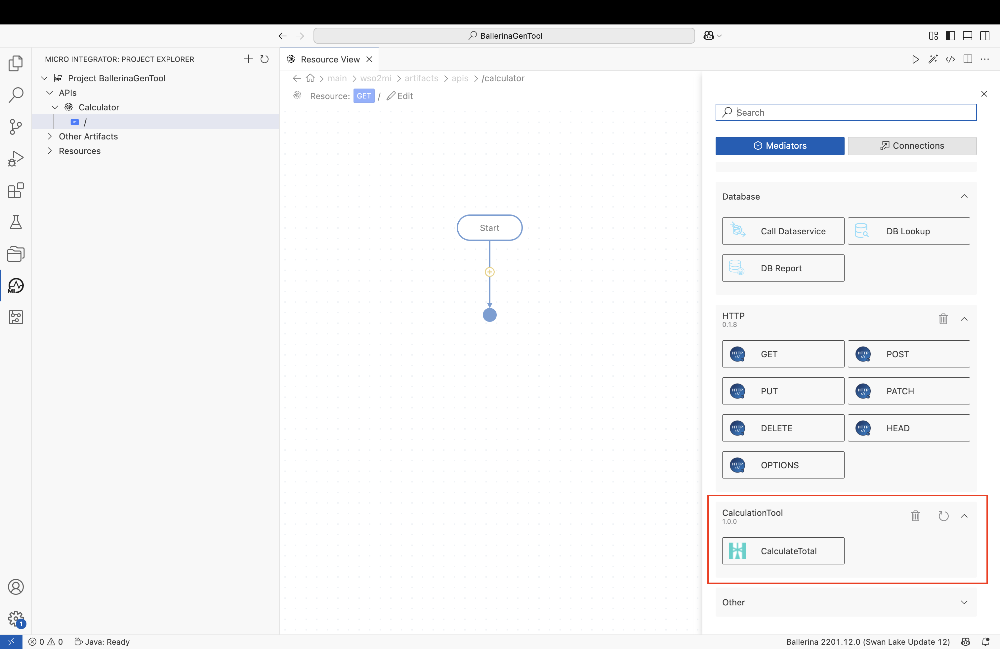
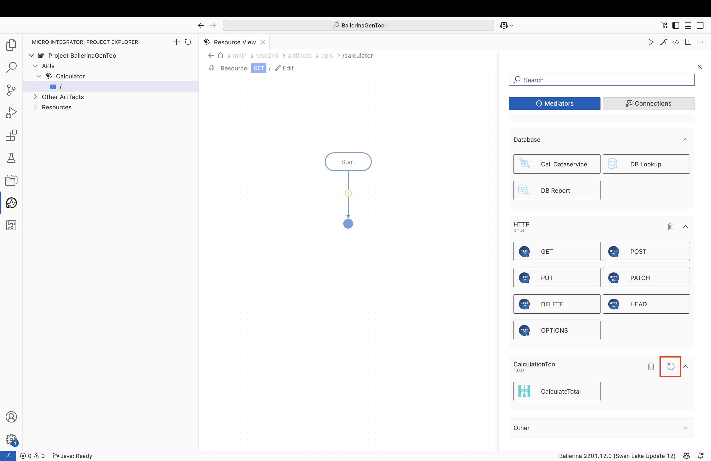

# WSO2 Micro Integrator module generator SDK for Ballerina

## Overview

The WSO2 Micro Integrator module generator SDK for Ballerina enables the generation of modules that allow the WSO2 MI to run Ballerina transformations.
This integration enables you to leverage the powerful transformation capabilities of Ballerina within
the environment of WSO2 Micro Integrator. Unlike Class Mediators, Ballerina is a cloud-native programming language with 
built-in support for JSON and XML, making data transformations simpler. It also allows the use of available Ballerina language 
modules and connectors, enabling enhanced functionality and easier connectivity with external systems.

**Version compatibility**:

**`wso2/mi` Connector version**|**Tool version**|**Ballerina Version**|**Java version**|**WSO2 MI version**|
:-----:|:-----:|:-----:|:-----:|:-----:
0.2| 0.2| 2201.10.3| 17| 4.2.0, 4.3.0
0.3| 0.3| 2201.11.0| 21| 4.4.0

## Step-by-Step Guide to Building a WSO2 MI Module from Ballerina with WSO2 Micro Integrator VS Code Extension

1. Install the [WSO2 Micro Integrator VSCode Extension](https://mi.docs.wso2.com/en/latest/develop/mi-for-vscode/install-wso2-mi-for-vscode/).
2. [Create](https://mi.docs.wso2.com/en/latest/develop/create-integration-project/) a new integration project or open an existing project.
3. Expand the artifact types in the `Add artifact` view and select **Ballerina Module**.


4. In the `Create Ballerina Module` form, enter a **name** and a **version** for the module and click **Create**.


5. Update the generated sample Ballerina code with your transformation logic and save the file.
6. Click the **Build Ballerina Module** icon.



_Note:
If the Kola Extension is not installed during the build process, you will be prompted to install it. Simply click the **Install** button to install the Kola Extension, and once the installation is complete, click the **Setup Kola** button to finalize the setup._



Once the Ballerina module is successfully built, it will appear in the `Mediator palette`, allowing it to be added when constructing integration flows.



If any changes are made to the transformation logic, the module can be rebuilt by clicking the **Build Ballerina Module** icon or by clicking the **Refresh** icon next to the relevant module in the Mediator Palette.



## Steps to create a module for WSO2 MI from Ballerina

### Pull `mi-module-gen` tool

First, you need to pull the `mi-module-gen` tool which is used to create the WSO2 MI module.

```bash
bal tool pull mi-module-gen
```

### Import the `wso2/mi` module

Create a new Ballerina project or use an existing one and write your transformation logic.
Import the module `wso2/mi` in your Ballerina program.

```ballerina
import wso2/mi;
```

### Write Ballerina transformation

Next, you need to write the Ballerina transformation in a Ballerina project.
For example,

```ballerina
@mi:Operation {}
public function gpa(xml rawMarks, xml credits) returns xml {
   // Your logic to calculate the GPA
}
```

Ballerina function that contains `@mi:Operation` annotation maps with an operation in the Ballerina module.

### Generate the module

Finally, use the `bal mi-module-gen` command to generate the WSO2 Micro Integrator module from Ballerina project.

```bash
bal mi-module-gen -i <path_to_ballerina_project>
```

Above command generates the module zip in the same location.

To add this generated module to a WSO2 Micro Integrator project follow the instruction specified [here](https://mi.docs.wso2.com/en/latest/develop/creating-artifacts/adding-connectors/).

## Local build

1. Clone the repository [ballerina-module-wso2-mi](https://github.com/wso2-extensions/ballerina-module-wso2-mi.git)

2. Build the compiler plugin and publish locally:

   ```bash
   ./gradlew clean :mi-ballerina:localPublish
   ```

3. Build the tool and publish locally:

   ```bash
   ./gradlew clean :tool-mi:localPublish 
   ```

### Run tests

   ```bash
   ./gradlew test
   ```

## Performance test description for WSO2 MI module

### Overview

The performance test for the WSO2 MI module was conducted using JMeter with 60 users. 
The aim was to evaluate the throughput per second for different payload sizes using 
three different transformation methods: Ballerina JSON transformation, Ballerina record transformation, 
and Java class mediator.

### Results

The following table shows the throughput per second for each transformation method across different payload sizes:

| Payload Size | Ballerina JSON transformation | Ballerina record transformation | Java class mediator |
|--------------|-------------------------------|---------------------------------|---------------------|
| 50B          | 13629.09                      | 12587.48                        | 15914.99            |
| 1024B        | 8151.94                       | 8032.21                         | 13035.26            |
| 10240B       | 1522.99                       | 1548.53                         | 12807.91            |
| 102400B      | 118.60                        | 118.79                          | 4792.20             |

### Test code
The specific code used for each transformation method is provided below:

#### Ballerina JSON transformation:

```ballerina
function getPayloadLenFromJson(json j) returns decimal {
    json|error payload = j.payload;
    if payload is error {
        return -1;
    }
    string str = <string> payload;
    decimal len = 0;
    foreach var _ in str {
        len = decimal:sum(len, 1);
    }
    return len;
}
```

#### Ballerina Record transformation:

```ballerina
type Payload record {|
    string size;
    string payload;
|};

function getPayloadLenFromRecord(json j) returns decimal {
    Payload|error payload = j.cloneWithType();
    if payload is error {
        return -1;
    }
    string str = payload.payload;
    decimal len = 0;
    foreach var _ in str {
        len = decimal:sum(len, 1);
    }
    return len;
}
```

#### Java Class mediator:

```Java
import java.math.BigDecimal;

import org.apache.synapse.MessageContext;
import org.apache.synapse.commons.json.JsonUtil;
import org.apache.synapse.core.axis2.Axis2MessageContext;
import org.apache.synapse.mediators.AbstractMediator;

import com.google.gson.JsonElement;
import com.google.gson.JsonObject;
import com.google.gson.JsonParser;

public class PayloadLength extends AbstractMediator {

   private final JsonParser jsonParser = new JsonParser();

   public boolean mediate(MessageContext context) {
      String jsonString = JsonUtil.jsonPayloadToString(((Axis2MessageContext) context).getAxis2MessageContext());
      JsonElement jsonElement = jsonParser.parse(jsonString);
      JsonObject jsonObject = jsonElement.getAsJsonObject();
      String payload = jsonObject.get("payload").getAsString();

      BigDecimal len = new BigDecimal(0);
      for (int i=0; i < payload.length(); i++) {
         len = len.add(new BigDecimal(1));
      }

      context.setProperty("result", len.toString());
      return true;
   }
}
```

## Contribute to Ballerina

As an open-source project, Ballerina welcomes contributions from the community.

For more information, go to the [contribution guidelines](https://github.com/ballerina-platform/ballerina-lang/blob/master/CONTRIBUTING.md).

## Code of conduct

All the contributors are encouraged to read the [Ballerina Code of Conduct](https://ballerina.io/code-of-conduct).
